import ModTutorialFragmentPhaseBuild from '/docs/_fragments/_fragment-phase-build.mdx';
import ModTutorialFragmentPhaseTest from '/docs/_fragments/_fragment-phase-test.mdx';
import ModTutorialFragmentStepOpenUnity from '/docs/_fragments/_fragment-step-open-unity.mdx';
import ModTutorialFragmentStepCreateIcon from '/docs/_fragments/_fragment-step-create-icon.mdx';
import ModTutorialFragmentStepTemplateWizard from '/docs/_fragments/_fragment-step-template-wizard.mdx';

This tutorial walks you through creating a **Sandbox Scene** mod, from generating the Scene template to preparing lighting and building the mod.

## Phase 1: Define your mod

<ModTutorialFragmentStepOpenUnity />

#### 5. Generate the folder structure with the Template Wizard

<ModTutorialFragmentStepTemplateWizard modType="Scene" />

#### 6. Build the scene

Create a new scene and build its environment.

For scene geometry that the player should collide with, add an appropriate collider and set its layer to `CharacterObstacle`.

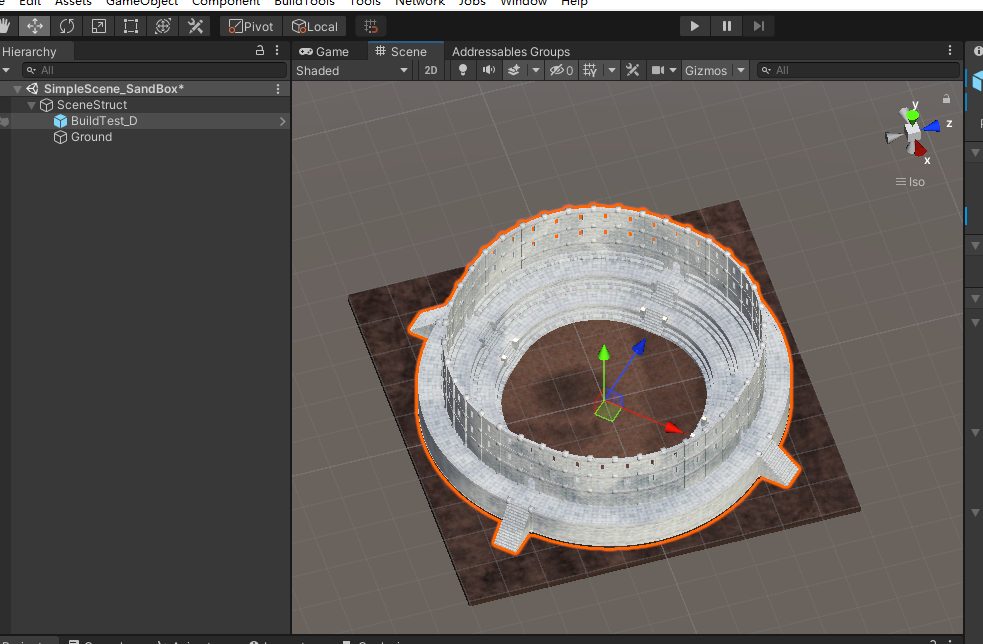

Use a `Rigidbody` with `Is Kinematic` enabled only on objects that need to participate in physics-based interactions. Static environment geometry normally does not need a Rigidbody.

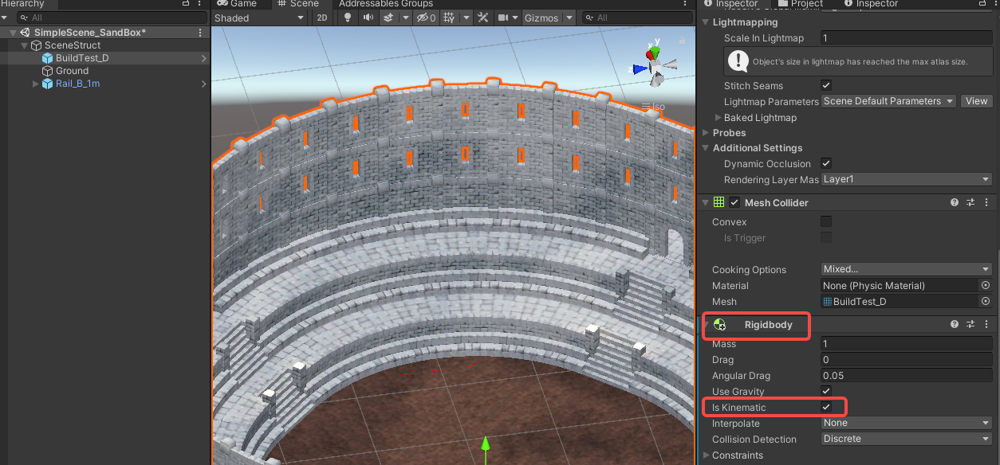

#### 7. Configure CharacterPos

Set `CharacterPos` under `SceneScriptNode` to choose where the player character spawns.

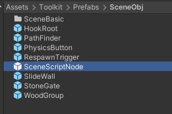

#### 8. Configure DeadZone and RespawnTrigger

Set the `Y` value of `DeadZone` under `SceneScriptNode` to define the lower limit of the playable area. When the character reaches this height, it respawns at the last activated [RespawnTrigger](/docs/details/deadzone-respawntrigger).

Place [RespawnTrigger](/docs/details/deadzone-respawntrigger) prefabs at the respawn locations you want to support. Size each trigger's `BoxCollider` so the player activates it while passing through.

#### 9. Configure PathFinder

Resize the `BoxCollider` on `PathFinder` under `SceneScriptNode` so it encloses the walkable area of the scene. The scene initialization script uses these bounds to create the navigation graph.

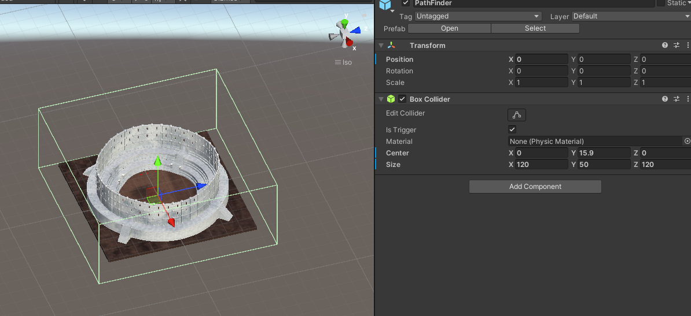

Save the scene.

#### 10. Add SandBoxControl

Drag `Toolkit/Prefabs/SceneObj/SandBoxControl.prefab` into the scene.

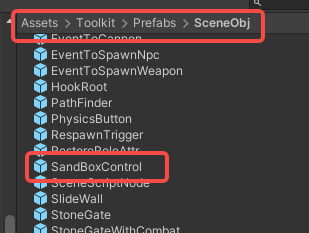

Select `SandBoxControl`. In its `SandBoxControlSetup` component, double-click an assigned reference to select the corresponding GameObject.

Only the GameObjects assigned to the `Transform` fields in `SandBoxControlSetup` can have their positions and rotations changed through this setup. Moving or rotating other scene nodes will not update those configured locations.

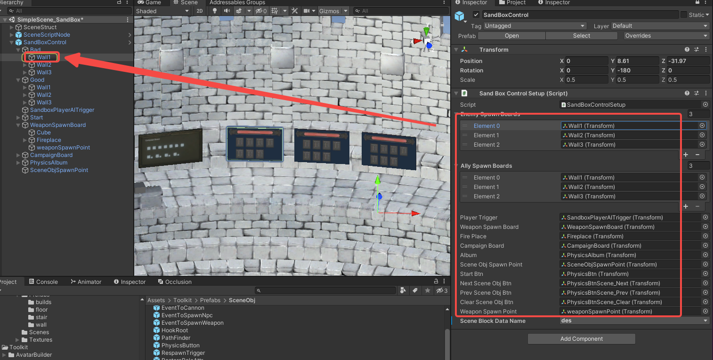

#### 11. Add lights

Add lights that suit the scene. A directional light is a common starting point for outdoor scenes.

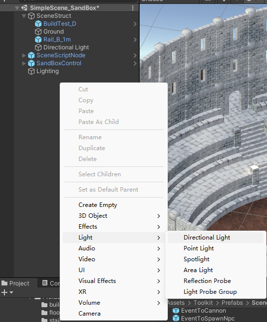

#### 12. Bake lightmaps

Select the static geometry that should receive baked lighting, such as buildings and ground, then enable the relevant `Static` options in the Inspector.

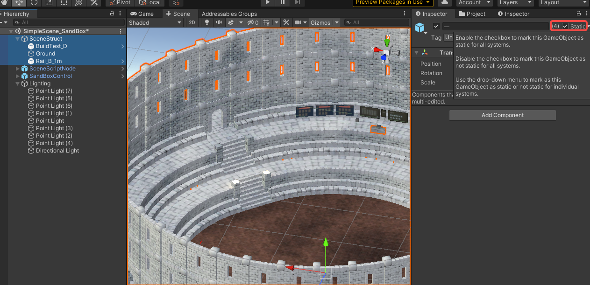

Select a light, such as the `Directional Light`, and choose `Mixed` or `Baked` in the Light component's `Mode` setting.

`Baked` lighting is stored in the baked data for eligible static geometry. Dynamic characters need light probes or a real-time or mixed light source to receive suitable lighting. `Mixed` lighting can retain baked indirect lighting while also providing real-time lighting and shadows for dynamic objects, subject to the project's quality settings.

To change multiple lights at once, open `Window > Rendering > Light Explorer`.

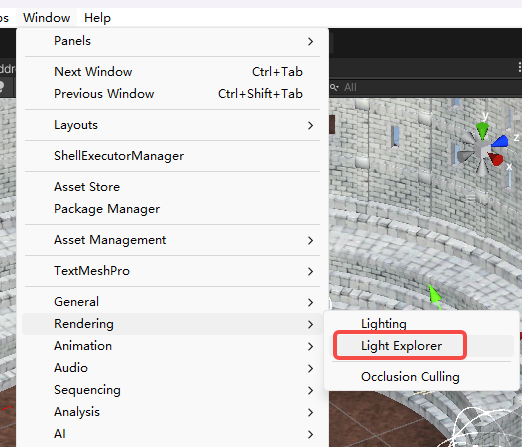

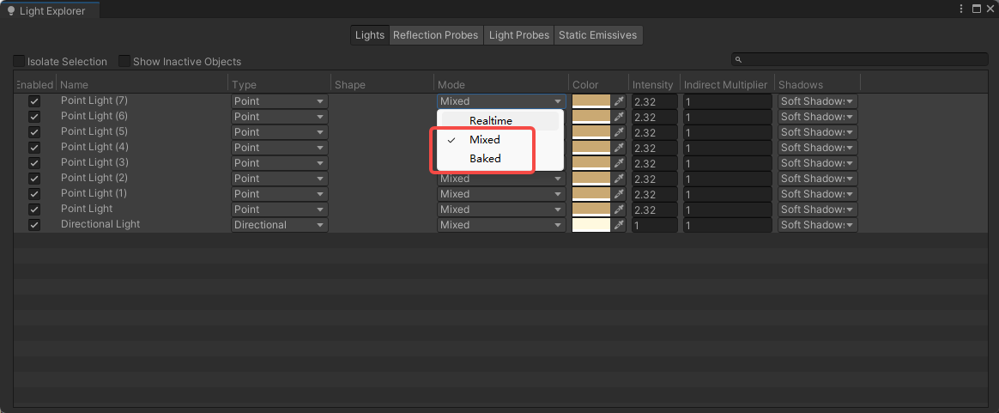

Open `Window > Rendering > Lighting`, then complete the following steps:

1. Select the **Scene** tab.
2. Drag the toolkit's `Assets/Toolkit/Light/Settings.lighting` asset into the **Lighting Settings** field.

   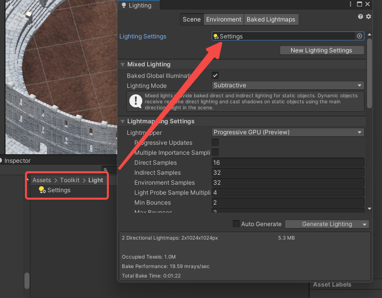

3. This supplied asset is a starting point. Adjust its settings only when your scene needs different lighting quality or bake settings; see [Unity's Lighting window documentation](https://docs.unity3d.com/2020.3/Documentation/Manual/lighting-window.html#Scene) for details.
4. In the **Baked Lightmaps** section, select **Generate Lighting**.

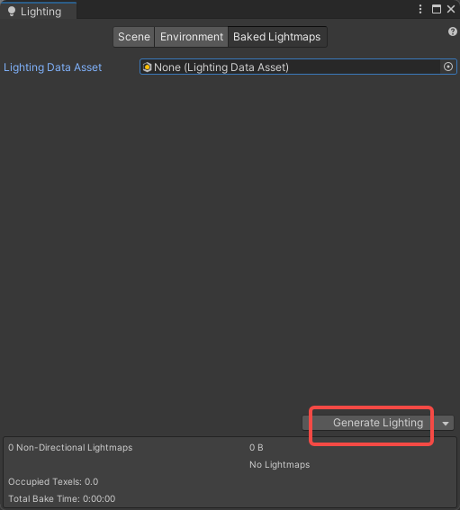

After baking finishes, Unity creates or updates `LightingData.asset` for the scene.

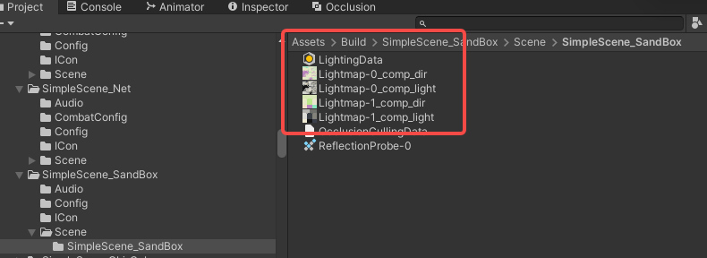

##### Verify lightmaps

1. In the Scene view control bar, open the **Draw Mode** dropdown. Under **Baked Global Illumination**, select **Baked Lightmap**. Scene geometry displays its baked lightmap as a checkered overlay, which confirms that the lightmap is applied correctly.

   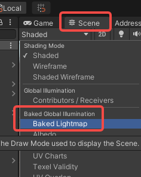

2. Add a temporary Camera to the scene, then enter Play mode. Move and rotate the Camera to inspect the scene from different viewpoints, looking for:
   - **Light leaking:** unwanted illumination in shadowed indoor areas next to bright outdoor light.
   - **Visible seams:** hard edges where separate UV charts meet, especially on modular meshes.

3. If light leaking appears, increase **Lightmap Resolution** in `Window > Rendering > Lighting`.

**Note:** Delete the temporary Camera before saving or building the mod, unless it is intentionally part of the scene.

#### 13. Bake occlusion culling

This optional step can improve performance by preventing rendering of static objects that are fully hidden from the player's view.

Mark static renderers for occlusion culling:

- Large, solid objects such as walls, buildings, and terrain should use `Occluder Static`.
- Static objects that can be hidden, such as decorations, small props, and transparent objects, should use `Occludee Static`.
- Objects that both hide other geometry and can be hidden should use both flags.

**Important:** Most static renderers should be marked `Occludee Static`; otherwise, occlusion culling will not remove them when they are hidden. Reserve `Occluder Static` for large, solid geometry that can form effective occlusion.

Dynamic objects, such as characters and movable props, are not included in the baked occlusion data. Their Renderer `Dynamic Occlusion` setting allows them to be culled at runtime by baked static occluders.

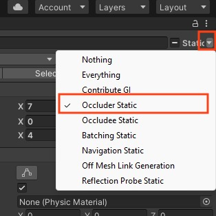

Open the Occlusion Culling window at `Window > Rendering > Occlusion Culling`.

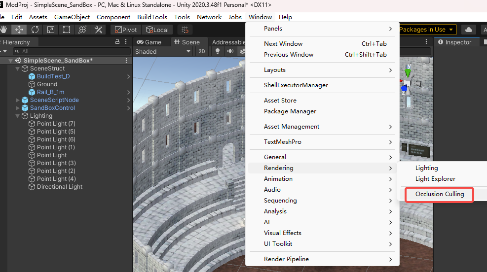

In the Occlusion Culling window, select **Bake**.

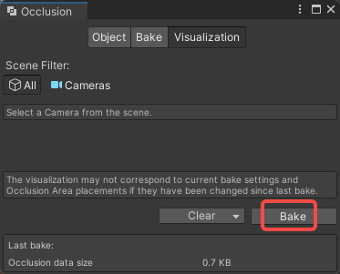

##### Verify occlusion culling

1. Select a Camera in the scene and make sure **Occlusion Culling** is enabled in its Inspector.
2. Open `Window > Rendering > Occlusion Culling` and select the **Visualization** tab.
3. Add a temporary Camera to the scene, move the Camera in the Scene view and confirm that objects hidden behind occluders disappear from view.
4. In the Scene view Occlusion Culling pop-up menu, enable **Camera Volumes** (yellow lines) and **Visibility Lines** (green lines) to help inspect the baked visibility data.

**Note:** Delete the temporary Camera before saving or building the mod, unless it is intentionally part of the scene.

Save the scene again.

## Phase 2: Prepare to export your mod

Create configuration files and fill in [SceneModInfo](/docs/details/item-info-config).

<ModTutorialFragmentStepCreateIcon modType="Scene" />

## Phase 3: Build the mod

<ModTutorialFragmentPhaseBuild />

## Phase 4: Test & publish the mod

<ModTutorialFragmentPhaseTest />
